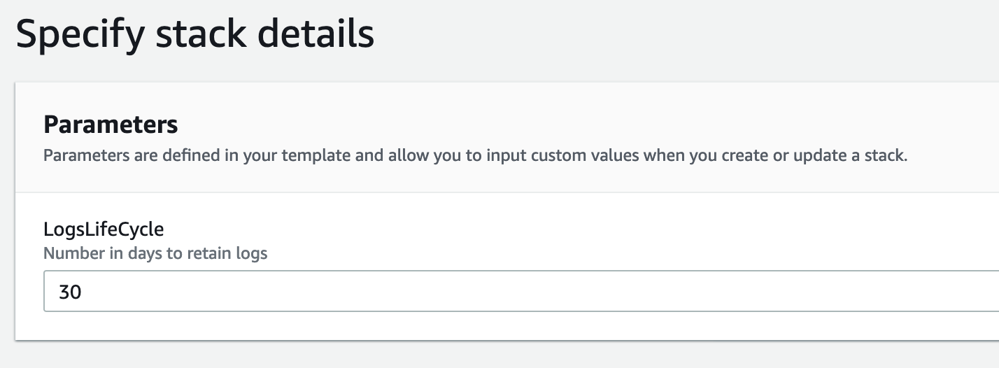
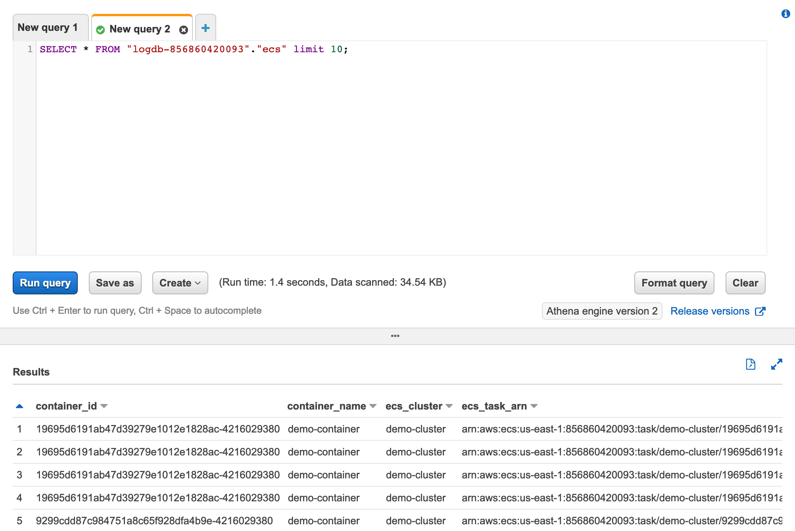
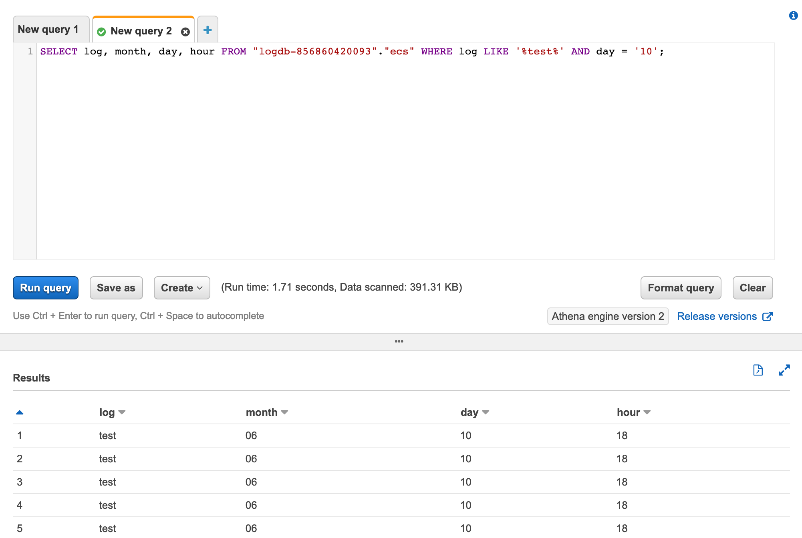
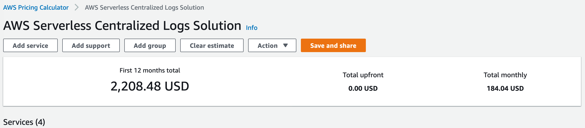
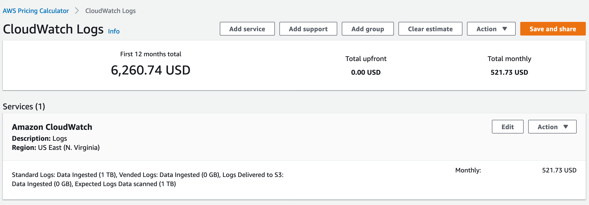

# AWS Serverless Centralized Logs Solution

## :wrench: Getting Started

As a first step we will execute a template in AWS Cloudformation which creates a stack that configures the following services:

| Service                      | Description                                                                         |
| ---------------------------- | ----------------------------------------------------------------------------------- |
| IAM Role                     | Creates roles and permissions for Amazon Kinesis Data Firehose and AWS Glue Crawler |
| Amazon S3                    | Creates log bucket with lifecycle policy                                            |
| AWS Glue                     | Creates AWS Glue database and crawler                                               |
| Amazon Kinesis Data Firehose | Creates one Amazon Kinesis Data Firehose for each log producer                      |

[Cloudformation link](deploy/centralized-logs.yaml)

When you upload the template for the stack in AWS **Console > Cloudformation**, it will request that you provided the parameters that will define the retention period of logs.

## :cloud: Running Samples

### ECS

[ECS sample link](samples/ecs)

### Lambda & API Gateway

[Lambda & API Gateway sample link](samples/lambda)

### EC2

[EC2 sample link](samples/ec2)

## :mag: Query Logs

Now go to Athena Query Editor on the AWS Console. Then you can select the name (logdb-_your_accountid_) you created in CloudFormation in the "Database" option of the Query Editor, and you should now be able to see the list of registered tables. If you want to click on the three dots next to a table name and request a preview of it, it will run a query for the first 10 lines. Check that it is working.

_PS.: Check if the AWS Glue Crawler was executed or execute it manually on Glue console._

Also, you are able to do more specific queries on logs.

## :dollar: Costs

This is an estimation of the solution based on the following requirements:

- Total of 1 TB/month logs ingested and stored;
- Total of 1 TB/month logs consumed;
- Calculated on N.Virginia (us-east-1) region at June, 2021;

_PS.: You can utilize the AWS Calculator to estimate your costs https://calculator.aws/_

## :lock: Security

See [CONTRIBUTING](CONTRIBUTING.md#security-issue-notifications) for more information.

## :scroll: License

This library is licensed under the MIT-0 License. See the LICENSE file.

## :memo: References and Links

- Containers:
  - https://aws.amazon.com/blogs/opensource/centralized-container-logging-fluent-bit/
  - https://aws.amazon.com/premiumsupport/knowledge-center/ecs-container-log-destinations-fargate/
  - https://github.com/aws-samples/amazon-ecs-firelens-examples
  - https://aws.amazon.com/blogs/containers/under-the-hood-firelens-for-amazon-ecs-tasks
  - https://docs.fluentbit.io/manual/pipeline/outputs/firehose
- Lambda:
  - https://aws.amazon.com/blogs/compute/using-aws-lambda-extensions-to-send-logs-to-custom-destinations/
  - https://boto3.amazonaws.com/v1/documentation/api/1.9.42/reference/services/firehose.html#Firehose.Client.put_record
- API Gateway:
  - https://docs.aws.amazon.com/apigateway/latest/developerguide/apigateway-logging-to-kinesis.html
- EC2:
  - https://docs.aws.amazon.com/firehose/latest/dev/writing-with-agents.html